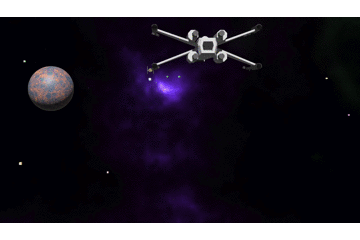

# bevy-fourth - 3D space game with rust and bevy

My fourth 3D game with rust(https://www.rust-lang.org) and the bevy framework(https://bevyengine.org)
using Rapier https://github.com/dimforge/bevy_rapier

A classic spaceshooter  
    
All assests are made by myself ind Blender (www.blender.org).

## 1. Step _ space and opponents

<br><br><br><br><br><br><br><br><br><br><br><br><br><br>


```Rust

```
