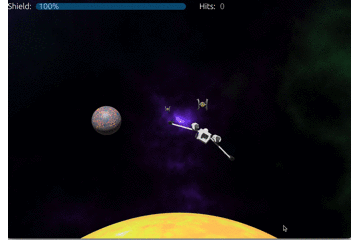
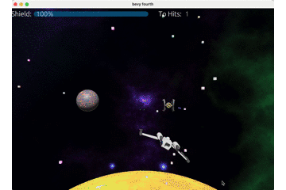

# bevy-planet-rust - 3D space game with rust and bevy

>“Greetings, Starpilot. You have been recruited by the Rust Alliance to defend the 
Planet Rust against Xplusians and the Pythones.  
>
>Rust is the way.
”


3D game with rust(https://www.rust-lang.org) and the bevy framework(https://bevyengine.org)
using Rapier https://github.com/dimforge/bevy_rapier

A classic space shooter  
    
All assests are made by myself in Blender (www.blender.org).

## 1. level - planet rust

<br><br><br><br><br><br><br><br><br><br><br><br><br><br>

## 2. level - asteroids

<br><br><br><br><br><br><br><br><br><br><br><br><br><br>

## 3. level - tower run

**comming soon**


```Rust

```
